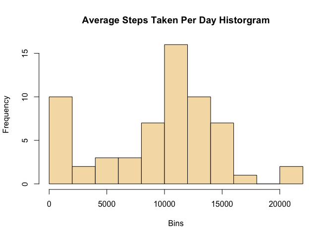
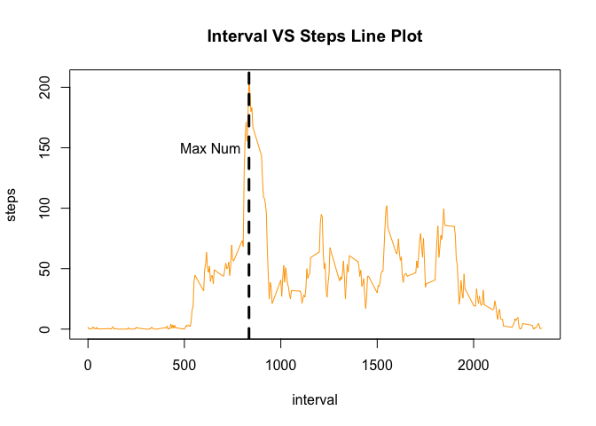
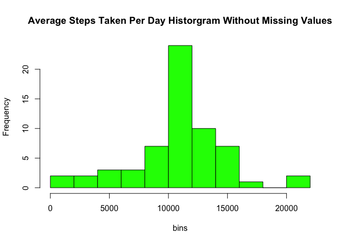
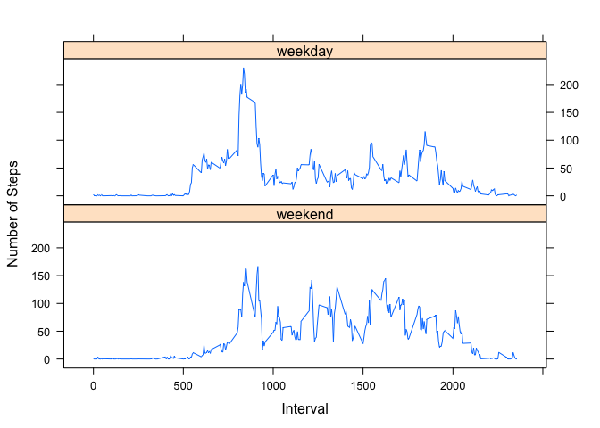

## Loading and preprocessing the data


```r
library(readr)
activity <- read_csv("/Users/steve/Desktop/datascience-JHU/Reproducible_Research/RepData_PeerAssessment1/activity.csv")
```

```
## Parsed with column specification:
## cols(
##   steps = col_double(),
##   date = col_date(format = ""),
##   interval = col_double()
## )
```

## What is mean total number of steps taken per day?

Load **tidyr** and **dplyr**, and preprocess the original dataframe and create the historgram.


```r
library(tidyr)
library(dplyr)
```

```
## 
## Attaching package: 'dplyr'
```

```
## The following objects are masked from 'package:stats':
## 
##     filter, lag
```

```
## The following objects are masked from 'package:base':
## 
##     intersect, setdiff, setequal, union
```

```r
activity_mean <-
    activity %>%
    group_by(date) %>%
    summarise(total_steps = sum(steps, na.rm = TRUE)) %>%
    ungroup()

hist(activity_mean$total_steps, breaks = 8, col = "wheat", xlab = "Bins", ylab = "Frequency", main = "Average Steps Taken Per Day Historgram")
```

<!-- -->

Get the mean total number of steps taken per day.


```r
mean(activity_mean$total_steps)
```

```
## [1] 9354.23
```

The mean total number of steps taken per day is **9354**

Get the median total number of steps taken per day.


```r
median(activity_mean$total_steps)
```

```
## [1] 10395
```

The median total number of steps taken per day is **1.0395\times 10^{4}**

## What is the average daily activity pattern?


```r
activity_interval <- activity %>% group_by(interval) %>% summarise(steps_by_interval = mean(steps, na.rm = TRUE))
interval_max <- activity_interval[which.max(activity_interval$steps_by_interval), "interval"]
with(activity_interval, plot(interval, steps_by_interval, col = "orange", type = "l", ylab = "steps", main = "Interval VS Steps Line Plot"))
abline(v = interval_max, lty = 2, lwd = 3)
text(interval_max-200, 150, labels = "Max Num")
```

<!-- -->

The Interval contains Max Number of Steps is **835**

## Imputing missing values


```r
# Calculate the total missing value in the dataframe
missing_rows <- sum(apply(activity, 1, function(x) {sum(is.na(x))}))
summary(activity)
```

```
##      steps             date               interval     
##  Min.   :  0.00   Min.   :2012-10-01   Min.   :   0.0  
##  1st Qu.:  0.00   1st Qu.:2012-10-16   1st Qu.: 588.8  
##  Median :  0.00   Median :2012-10-31   Median :1177.5  
##  Mean   : 37.38   Mean   :2012-10-31   Mean   :1177.5  
##  3rd Qu.: 12.00   3rd Qu.:2012-11-15   3rd Qu.:1766.2  
##  Max.   :806.00   Max.   :2012-11-30   Max.   :2355.0  
##  NA's   :2304
```
The total number of missing rows is **2304**
Using summary function is the simplest way to find how many missing rows exist in each variable.

All the missing values exist in "steps" variable, so "steps" column is the only column we need to deal with during imputation.
I use the simpliest impute strategy that is just using the mean steps by interval. 
I use the dplyr to reshape the dataframe and get the mean steps by interval, and then fill in the missing values in steps.


```r
steps_na <-
    (activity %>%
         group_by(interval) %>%
         mutate(mean_steps = mean(steps, na.rm = TRUE)) %>%
         filter(is.na(steps)))

activity[is.na(activity$steps), "steps"] <- steps_na$mean_steps

new_activity_mean <- activity %>% group_by(date) %>% summarise(total_steps = sum(steps))

hist(new_activity_mean$total_steps, breaks = 8, col = "green", xlab = "bins", ylab = "Frequency", main = "Average Steps Taken Per Day Historgram Without Missing Values")
```

<!-- -->

Get the mean total number of steps taken per day.


```r
mean(new_activity_mean$total_steps)
```

```
## [1] 10766.19
```

The mean total number of steps taken per day is **1.0766\times 10^{4}**

Get the median total number of steps taken per day.


```r
median(new_activity_mean$total_steps)
```

```
## [1] 10766.19
```

The median total number of steps taken per day is **1.0766189\times 10^{4}**

### Conclusion

After imputing the dataframe the new mean is **1.0766\times 10^{4}** that is greater than the old mean **9354**. 

And the new median is **1.0766189\times 10^{4}** that is greater than the old mean **1.0395\times 10^{4}**

The imputation increase both the mean value and the median value, and make the gap between new mean value and new median values much smaller compared to the gap between old ones. This imputation strategy also change the shape of historgram a little bit.

## Are there differences in activity patterns between weekdays and weekends?

Showing the differences in activity patterns between weekdays and weekends by using xyplot in lattice package.


```r
library(lattice)
activity$week_col <- weekdays(activity$date) %in% c("Saturday", "Sunday")
activity$week_col <- factor(activity$week_col, levels = c(TRUE, FALSE), labels = c("weekend", "weekday"))
activity_weekday <- activity %>% group_by(interval, week_col) %>% summarise(mean_steps = mean(steps))
xyplot(mean_steps ~ interval | week_col, data = activity_weekday, type = "l", layout = c(1, 2), xlab = "Interval", ylab = "Number of Steps")
```

<!-- -->

The plot shows that average steps in weekdays got bigger increase than the average steps in weekend after interval beyond 500. 
